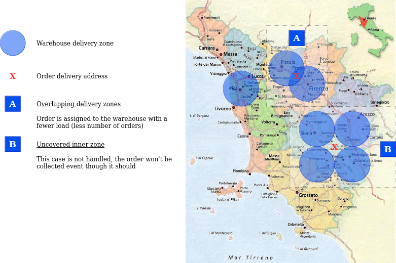

# esselunga-manager

## Assumptions

* A warehouse can deliver orders within a certain radius from its position.<br>
    The following image addresses a pair of scenarios:

    

* Products availability in a warehouse is not checked, any order is always deliverable.

* All orders are assigned to a single vehicle which has infinite load capacity.

* Products in an order are referenced by their ID.<br>
    Holding the list of all available products is outside the scope of this service,
    this means anything can be used as ID (e.g. "pizza")

## Project structure

```text
.
├─ assets           : static files
├─ concorde         : sources of TSP solver library 
├─ QS               : QSopt LP solver
├─ src
│  └─ main
│     └─ C          : shared library implementing TSP solver
       

```
## Building concorde


## Packaging and running the application

The application can be packaged using:

```shell script
./mvnw package
```

It produces the `quarkus-run.jar` file in the `target/quarkus-app/` directory.
Be aware that it’s not an _über-jar_ as the dependencies are copied into the `target/quarkus-app/lib/` directory.

The application is now runnable using `java -jar target/quarkus-app/quarkus-run.jar`.

If you want to build an _über-jar_, execute the following command:

```shell script
./mvnw package -Dquarkus.package.jar.type=uber-jar
```

The application, packaged as an _über-jar_, is now runnable using `java -jar target/*-runner.jar`.

## Creating a native executable

You can create a native executable using:

```shell script
./mvnw package -Dnative
```

Or, if you don't have GraalVM installed, you can run the native executable build in a container using:

```shell script
./mvnw package -Dnative -Dquarkus.native.container-build=true
```

You can then execute your native executable with: `./target/esselunga-manager-1.0-SNAPSHOT-runner`
